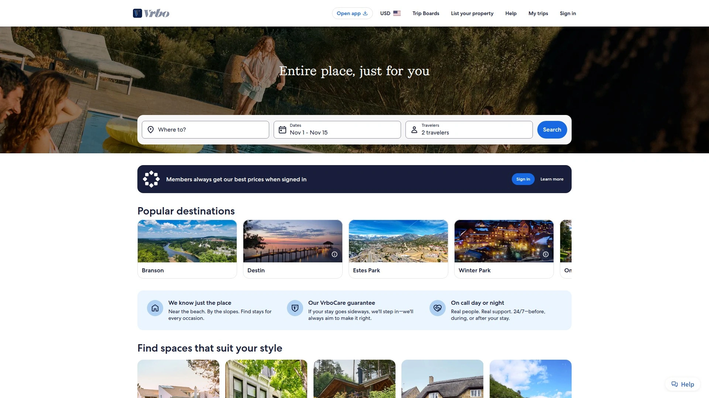
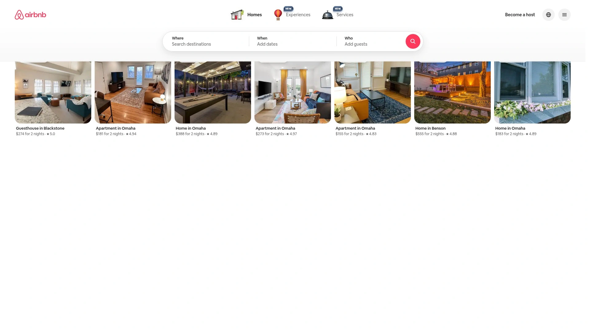
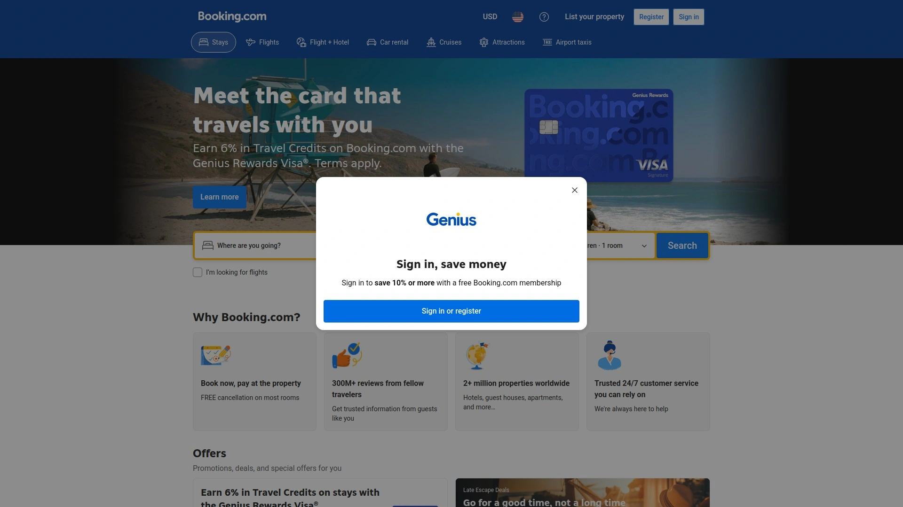
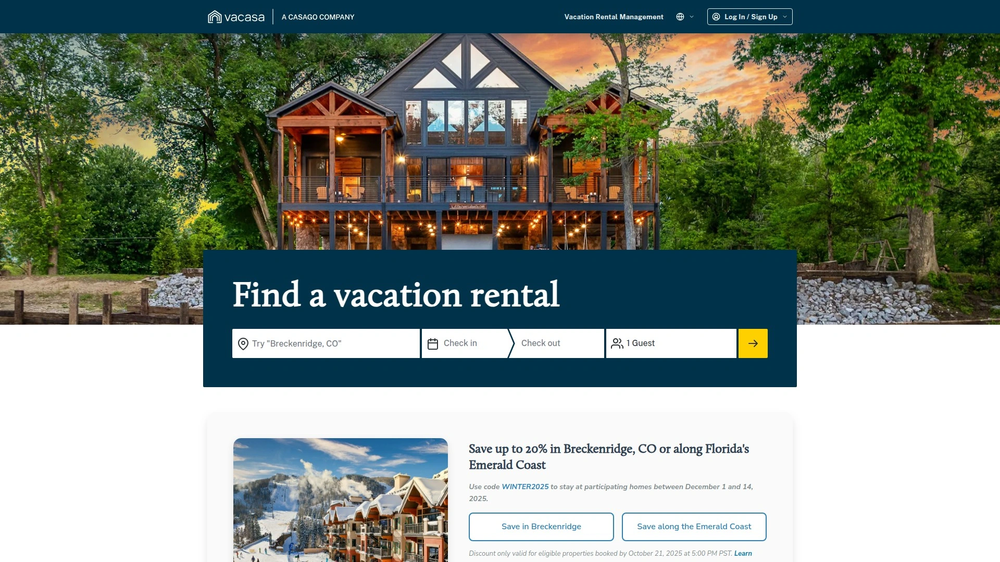
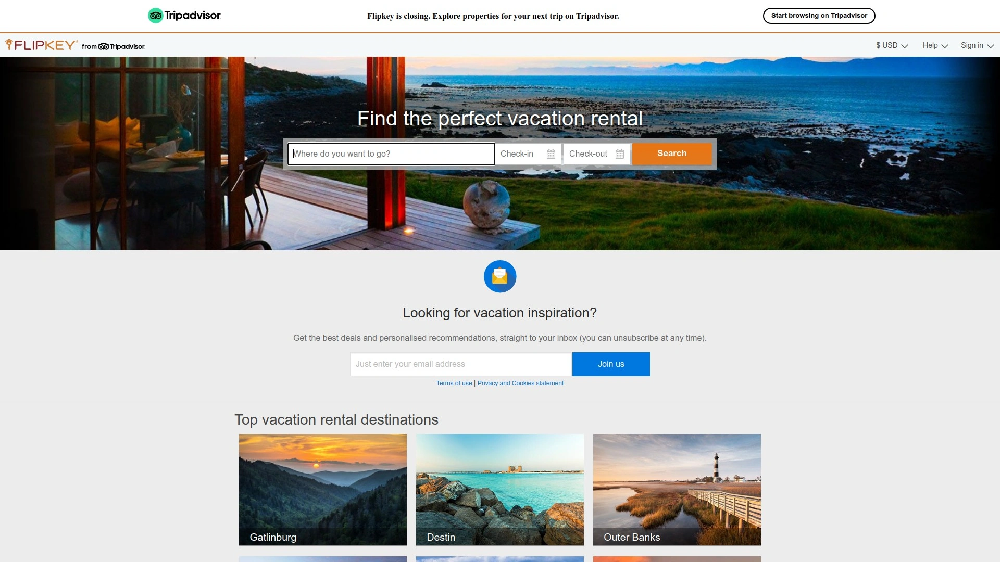
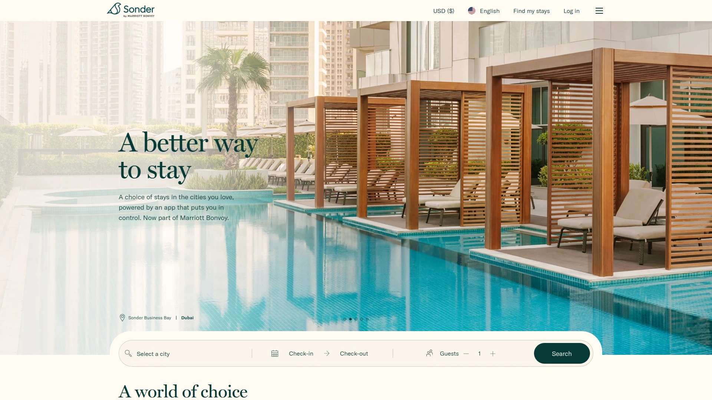
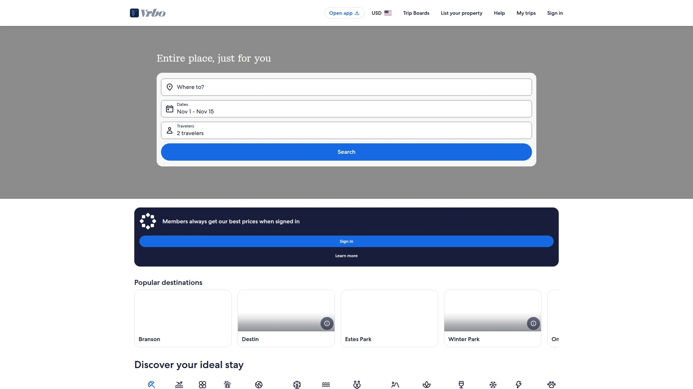
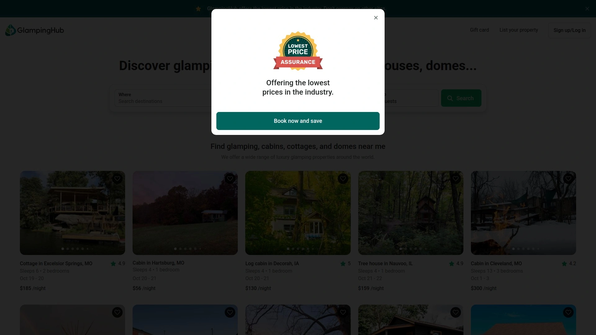
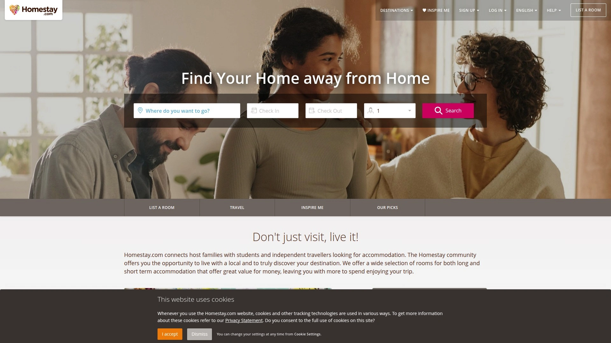

# Top 12 Best Vacation Rental Platforms in 2025

Finding the perfect vacation rental shouldn't feel like scrolling through endless listings with questionable photos and vague descriptions. Whether you're planning a family reunion in a beachfront villa or seeking a cozy mountain cabin for a solo retreat, these vacation rental platforms connect travelers with verified properties, transparent pricing, and secure booking processes that protect both guests and hosts throughout your stay.

---

## **[Vrbo](https://www.vrbo.com)**

Family-focused vacation rental marketplace specializing in entire homes perfect for group travel and extended stays.

Vrbo distinguishes itself by exclusively listing whole properties rather than shared spaces, making it the go-to platform for families and groups seeking privacy. With over 2 million properties across 190 countries, the platform emphasizes quality over quantity, featuring detailed property descriptions, professional photography, and comprehensive amenity lists. Their Book with Confidence Guarantee provides payment protection, emergency rebooking assistance, and 24/7 customer support throughout your journey.

The platform's advanced search filters help narrow options by specific needs like pet-friendly spaces, wheelchair accessibility, or properties with pools and hot tubs. Vrbo's Trip Boards feature allows group coordination, letting multiple travelers vote on properties and share notes before booking. Integration with parent company Expedia's loyalty program means members can earn and redeem points across multiple travel platforms.

---

## **[Airbnb](https://www.airbnb.com)**

Global hospitality pioneer offering everything from spare rooms to castles, plus unique experiences hosted by locals.

**Why it dominates the market:**
Airbnb revolutionized travel accommodation by creating a trusted marketplace where anyone can monetize their extra space. The platform now features over 7 million listings ranging from budget-friendly rooms to luxury villas. Their Superhost program highlights top-rated hosts who maintain exceptional standards, while Airbnb Plus offers professionally verified homes meeting 100+ quality criteria.

Beyond traditional stays, Airbnb Experiences connects travelers with local hosts offering cooking classes, guided tours, and unique activities. The platform's review system creates transparency with separate ratings for cleanliness, communication, check-in, accuracy, location, and value. Smart pricing tools help hosts optimize rates based on demand, while instant booking options streamline the reservation process for guests.

---

## **[Booking.com](https://www.booking.com)**

Comprehensive travel platform combining vacation rentals with hotels, offering flexible cancellation and no booking fees.

Booking.com aggregates over 28 million listings including apartments, villas, and unique stays alongside traditional hotels. Their standout feature remains free cancellation on most properties, providing flexibility for uncertain travel plans. The platform's Genius loyalty program unlocks exclusive discounts and perks like free breakfast or room upgrades after just two bookings.

The interface excels at last-minute bookings with real-time availability and instant confirmation for most properties. Mobile app features include offline maps, translation tools, and digital check-in options. Their customer service operates in 40+ languages, ensuring support regardless of your destination.

---

## **[Vacasa](https://www.vacasa.com)**

Professional vacation rental management company ensuring consistent quality across all listed properties.

**Managed marketplace advantages:**
Unlike peer-to-peer platforms, Vacasa professionally manages every property in their portfolio, guaranteeing standardized cleanliness, maintenance, and guest services. Each home undergoes rigorous inspection and features professional photography, 3D virtual tours, and detailed floor plans. Their local teams handle everything from check-in to emergency maintenance, eliminating common vacation rental frustrations.

Properties include premium amenities like high-speed WiFi, quality linens, and fully stocked kitchens. The Vacasa app provides keyless entry, local recommendations, and direct messaging with support teams. Their worry-free cancellation policy and travel insurance options protect against unexpected changes.

---

## **[FlipKey](https://www.flipkey.com)**

TripAdvisor-powered vacation rental platform leveraging millions of traveler reviews for verified quality.

FlipKey benefits from TripAdvisor's massive review ecosystem, providing extensive traveler feedback on properties and destinations. The platform specializes in vacation homes with verified owner profiles and detailed property histories. Their Perfect Match feature uses quiz-style questions to recommend properties matching your travel style and preferences.

Integration with TripAdvisor means you can seamlessly research attractions, restaurants, and activities near your rental. The platform's payment protection includes secure transactions and assistance if properties don't match descriptions. Mobile tools provide instant messaging with owners and digital guidebooks for each destination.

---

## **[Plum Guide](https://www.plumguide.com)**

Curated collection of exceptional homes where every property passes a 150-point quality test.

Plum Guide accepts only 3% of applicant properties, ensuring every listing meets exceptional standards for design, comfort, and location. Their expert reviewers personally visit each home, testing everything from WiFi speed to shower pressure. The result is a boutique collection of homes that consistently exceed expectations without the uncertainty of peer-to-peer platforms.

**What sets them apart:** Professional concierge services arrange everything from airport transfers to private chefs. Their Plum Guarantee promises alternative accommodation or full refunds if properties disappoint. The platform focuses on major cities and popular destinations rather than attempting global coverage, ensuring deep local expertise in each market.

---

## **[Sonder](https://www.sonder.com)**

Tech-enabled hospitality brand offering apartment-style accommodations with hotel-like reliability and service.

Sonder operates their own properties, designing and managing each space for optimal guest experience. Their apartments feature consistent modern design, fully equipped kitchens, and contactless check-in via mobile app. Unlike traditional vacation rentals, Sonder provides hotel-style services including daily cleaning options and 24/7 customer support.

Properties cluster in prime urban locations, ideal for business and leisure travelers seeking apartment comfort with hotel convenience. The Sonder app controls everything from booking to check-out, including digital keys, neighborhood guides, and instant support chat. Flexible cancellation policies and transparent pricing without hidden fees simplify travel planning.

---

## **[OneFineStay](https://www.onefinestay.com)**

Luxury vacation rental service combining high-end homes with five-star hospitality services.

**Luxury redefined in vacation rentals:**

OneFineStay, now part of Accor, curates exceptional homes in the world's most desirable destinations. Each property undergoes meticulous preparation including professional photography, luxury amenities, and personalized touches. Their signature service includes meet-and-greet check-ins, iPhone loans for international connectivity, and dedicated guest services throughout your stay.

Properties feature premium bedding, bathroom products from high-end brands, and fully stocked kitchens. Optional services include private chefs, spa treatments, and curated experiences. The platform's rigorous vetting ensures every home meets luxury hotel standards while maintaining unique character and charm.

---

## **[HomeAway](https://www.homeaway.com)**

Established vacation rental marketplace now integrated with Vrbo, offering extensive inventory and family-friendly options.

HomeAway pioneered online vacation rentals before merging with Vrbo, maintaining a strong presence in traditional vacation markets. The platform excels in beach, mountain, and resort destinations with properties ranging from condos to large estates. Their detailed search filters help families find specific amenities like cribs, high chairs, and game rooms.

Guest verification and secure payment processing protect both parties in transactions. The platform's messaging system maintains communication records while protecting personal information. Travel insurance options and 24/7 customer support provide peace of mind for family vacations.

---

## **[Glamping Hub](https://glampinghub.com)**

Specialized platform for unique outdoor accommodations blending nature with comfort.

Glamping Hub curates extraordinary outdoor stays including safari tents, treehouses, yurts, and converted vehicles. Each listing provides detailed amenity information distinguishing true glamping from basic camping. Properties range from off-grid eco-retreats to luxury resorts with full service.

The platform's expertise in outdoor accommodations means accurate descriptions of accessibility, weather considerations, and what to pack. Their collection spans six continents, offering everything from Northern Lights viewing domes to tropical beach huts. Dedicated customer service understands unique glamping needs like pet policies and adventure activity arrangements.

---

## **[Kid & Coe](https://www.kidandcoe.com)**

Boutique vacation rental platform specifically designed for family travel with style-conscious parents.

**Family travel reimagined:**

Kid & Coe carefully selects properties that balance design aesthetics with family functionality. Each listing includes detailed child-safety information, available baby gear, and nearby family attractions. The platform's founders personally vet homes for both style and practicality, ensuring beautiful spaces that accommodate real family needs.

Properties feature thoughtful touches like toy collections, children's books, and outdoor play areas. The platform's community includes traveling families sharing destination tips and property reviews from a parent's perspective. Search filters include specific age-appropriate amenities and proximity to family-friendly activities.

---

## **[Homestay](https://www.homestay.com)**

Cultural immersion platform connecting travelers with local hosts offering rooms in their occupied homes.

Homestay focuses on authentic cultural exchange rather than standalone properties. Hosts share their homes and often meals, providing insider knowledge and genuine local experiences. The platform thoroughly vets hosts including background checks and property verification, ensuring safe and welcoming environments.

Ideal for students, solo travelers, and anyone seeking deeper cultural connections. Many hosts offer language practice, cooking lessons, or guided local experiences. The platform's messaging system includes translation features facilitating communication across language barriers. Detailed host profiles include interests, languages spoken, and house rules, helping guests find compatible matches.

---

# FAQ Common Questions

**Q: How do I ensure a vacation rental is legitimate and matches its listing?**
A: Book through established platforms with verified listings, read recent reviews carefully, and look for properties with professional photos and detailed descriptions. Platforms like Vrbo and Vacasa offer guarantees and support if properties don't match expectations.

**Q: What's the best platform for large family gatherings or group travel?**
A: Vrbo specializes in entire properties perfect for groups, with advanced filters for multi-bedroom homes and specific amenities like multiple bathrooms and large dining areas that accommodate everyone comfortably.

**Q: Should I book vacation rentals with free cancellation or non-refundable rates?**
A: Choose free cancellation when plans might change, especially for bookings made far in advance. Non-refundable rates typically offer 10-20% savings but require confidence in your travel dates.

---

# Conclusion

These twelve vacation rental platforms each excel in different areas, from luxury escapes to family adventures and cultural immersion experiences. [Vrbo](https://www.vrbo.com) stands out for families and groups seeking entire properties with consistent quality, comprehensive protection policies, and tools designed specifically for coordinating group travel, making it the ideal starting point for your next memorable vacation.
